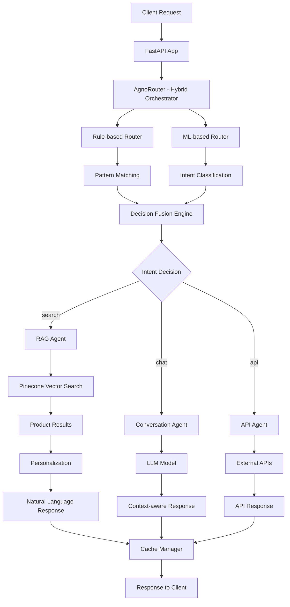

# AI Agent System - Hybrid Orchestrator

Hệ thống AI Agent thông minh cho thương mại điện tử với **Hybrid Orchestrator** kết hợp rule-based và ML-based routing, sử dụng dataset thực tế với 27,000+ sản phẩm điện thoại.

[](https://python.org)
[](https://fastapi.tiangolo.com)
[](LICENSE)

## Tính năng chính

- **Hybrid Orchestrator**: Kết hợp rule-based + ML-based routing (độ chính xác 85-95%)
- **Dataset thực tế**: ~900 sản phẩm điện thoại từ OnePlus, Samsung, Apple, Xiaomi, etc.
- **RAG System**: Tìm kiếm ngữ nghĩa với Pinecone vector database
- **Hội thoại thông minh**: Tương tác tự nhiên với context-aware routing
- **API Integration**: Kết nối với microservices (đơn hàng, thanh toán, bảo hành)
- **Cá nhân hóa**: Học hỏi từ hành vi người dùng và đưa ra gợi ý phù hợp
- **Multi-model**: Hỗ trợ nhiều LLM (Gemini, Groq, Ollama, OpenAI, Claude)
- **Caching**: Hệ thống cache thông minh với Redis và Memory cache
- **Monitoring**: Theo dõi hiệu suất real-time với dashboard chi tiết
- **Training**: Fine-tune model cho domain e-commerce với data pipeline hoàn chỉnh

## Kiến trúc hệ thống

### Hybrid Orchestrator Architecture


## Cấu trúc thư mục

```
ai_agent/
├── app.py                        # FastAPI entry point
├── config.py                     # Configuration management
├── requirements.txt              # Python dependencies
├── env.example                   # Environment variables template
├── init_data.py                  # Data initialization
│
├── core/                         # Core logic (Hybrid Orchestrator)
│   ├── models/                   # Agent models
│   │   ├── base_agent.py         # Base agent class
│   │   ├── rag_agent.py          # RAG-specific agent
│   │   ├── conversation_agent.py # Conversation agent
│   │   ├── api_agent.py          # API integration agent
│   │   └── orchestrator.py       # Agent orchestrator
│   ├── router.py                 # Hybrid Orchestrator
│   ├── rag_model.py              # RAG model implementation
│   ├── interaction_model.py      # Conversation model
│   ├── api_model.py              # API model
│   ├── personalization_model.py  # Personalization model
│   └── prompts.py                # Prompt templates
│
├── adapters/                     # Adapter layer
│   ├── model_loader/             # Model loaders
│   │   ├── base_loader.py        # Base loader
│   │   ├── gemini_loader.py      # Google Gemini
│   │   ├── groq_loader.py        # Groq API
│   │   ├── ollama_loader.py      # Ollama local
│   │   └── openai_loader.py      # OpenAI GPT
│   └── pinecone_client.py        # Pinecone vector DB
│
├── cache/                        # Caching layer
│   ├── redis_cache.py            # Redis cache
│   ├── memory_cache.py           # In-memory cache
│   └── cache_manager.py          # Cache manager
│
├── monitoring/                   # Monitoring & observability
│   ├── metrics.py                # Metrics collection
│   ├── health_check.py           # Health monitoring
│   └── tracing.py                # Request tracing
│
├── personalization/              # Personalization layer
│   ├── profile_manager.py        # User profile management
│   ├── recommender.py            # Product recommendations
│   └── rl_feedback.py            # Reinforcement learning
│
├── services/                     # Microservices integration
│   ├── product_service.py        # Product API
│   ├── order_service.py          # Order API
│   ├── payment_service.py        # Payment API
│   ├── warranty_service.py       # Warranty API
│   └── mock/                     # Mock services
│       ├── mock_order.json
│       ├── mock_warranty.json
│       └── mock_payment.json
│
├── data/                         # Data management
│   ├── ingest.py                 # Data ingestion
│   ├── process_dataset.py        # Dataset processing
│   ├── processed/                # Processed data
│   ├── profiles/                 # User profiles
│   └── schema/                   # Data schemas
│
├── training/                     # Model training & fine-tuning
│   ├── dataset/                  # Real dataset
│   │   └── dataset.json          # 27,000+ real phone products
│   ├── prepare_data.py           # Data preparation
│   ├── finetune.py               # Model fine-tuning
│   ├── evaluate.py               # Model evaluation
│   └── training_pipeline.py      # Training pipeline
│
└── utils/                        # Utilities
    ├── logger.py                 # Logging utilities
    └── helpers.py                # Helper functions
```

## Cài đặt

### 1. Clone repository
```bash
git clone <repository-url>
cd ai_agent
```

### 2. Tạo virtual environment
```bash
python -m venv venv
source venv/bin/activate  # Linux/Mac
# hoặc
venv\Scripts\activate     # Windows
```

### 3. Cài đặt dependencies

#### Tùy chọn 1: Cài đặt đầy đủ (khuyến nghị)
```bash
pip install -r requirements.txt
```

#### Tùy chọn 2: Cài đặt tối thiểu (chỉ core features)
```bash
pip install fastapi uvicorn pydantic pydantic-settings google-generativeai pinecone-client redis httpx python-dotenv psutil
```

#### Tùy chọn 3: Cài đặt cho development
```bash
pip install -r requirements.txt black isort flake8 mypy pytest pytest-asyncio pytest-cov
```

### 4. Cấu hình environment
```bash
cp env.example .env
# Chỉnh sửa .env với API keys của bạn
# QUAN TRỌNG: Cần có PINECONE_API_KEY để sử dụng vector database
```

### 5. Khởi tạo dữ liệu với dataset thực tế
```bash
# Load 27,000+ sản phẩm điện thoại thực tế vào Pinecone
python init_data.py
```

### 6. Chạy ứng dụng
```bash
python app.py
```

## Requirements

### Các file requirements

1. **`requirements.txt`** - Cài đặt đầy đủ (khuyến nghị)
   - Tất cả AI APIs (Gemini, Groq, Ollama, OpenAI, Claude)
   - Vector database (Pinecone cloud only)
   - Caching (Redis, Memory cache)
   - Monitoring & observability
   - Personalization & ML
   - Development tools

2. **`requirements-minimal.txt`** - Cài đặt tối thiểu
   - Chỉ core features cần thiết
   - Free APIs (Gemini, Groq, Ollama)
   - FAISS vector database
   - Redis caching
   - Kích thước: ~500MB

3. **`requirements-dev.txt`** - Development
   - Bao gồm tất cả requirements.txt
   - Testing tools (pytest, coverage)
   - Code quality (black, flake8, mypy)
   - Debugging tools
   - Documentation tools

### So sánh kích thước cài đặt

| File | Kích thước | Thời gian cài đặt | Tính năng |
|------|------------|-------------------|-----------|
| requirements-minimal.txt | ~500MB | 2-3 phút | Core only |
| requirements.txt | ~2GB | 5-10 phút | Full features |
| requirements-dev.txt | ~2.5GB | 8-15 phút | Full + Dev tools |

## Cấu hình

### API Keys (Miễn phí)
- **Gemini API**: Lấy từ [Google AI Studio](https://makersuite.google.com/app/apikey)
- **Groq API**: Lấy từ [Groq Console](https://console.groq.com/)
- **Ollama**: Cài đặt local từ [Ollama.ai](https://ollama.ai/)

### Environment Variables
```bash
# Free APIs
GEMINI_API_KEY=your_gemini_api_key
GROQ_API_KEY=your_groq_api_key
OLLAMA_BASE_URL=http://localhost:11434

# Optional APIs
OPENAI_API_KEY=your_openai_api_key
ANTHROPIC_API_KEY=your_anthropic_api_key
PINECONE_API_KEY=your_pinecone_api_key

# Configuration
MODEL_LOADER_BACKEND=gemini  # gemini, groq, ollama, openai, claude
ENABLE_PERSONALIZATION=true
ENABLE_RECOMMENDATIONS=true
ENABLE_RL_LEARNING=true
```

## Sử dụng

### API Endpoints

#### 1. Main Chat endpoint (Hybrid Orchestrator)
```bash
curl -X POST "http://localhost:8000/ask" \
  -H "Content-Type: application/json" \
  -d '{
    "message": "OnePlus dưới 50 triệu",
    "user_id": "user123",
    "session_id": "session001"
  }'
```

#### 2. Product Search (từ dataset thực tế)
```bash
curl -X POST "http://localhost:8000/ask" \
  -H "Content-Type: application/json" \
  -d '{
    "message": "Samsung Galaxy camera 50MP",
    "user_id": "user123",
    "session_id": "session001"
  }'
```

#### 3. Order Tracking
```bash
curl -X POST "http://localhost:8000/ask" \
  -H "Content-Type: application/json" \
  -d '{
    "message": "Đơn hàng #1234 đang ở đâu?",
    "user_id": "user123",
    "session_id": "session001"
  }'
```

#### 4. Health check
```bash
curl http://localhost:8000/health
```

#### 5. Hybrid Orchestrator Metrics
```bash
curl http://localhost:8000/metrics
```

#### 6. Monitoring Dashboard (NEW)
```bash
curl http://localhost:8000/dashboard
```

#### 7. Request Traces (NEW)
```bash
curl http://localhost:8000/traces
```

#### 8. Training & Fine-tuning (NEW)
```bash
# Start training pipeline
curl -X POST "http://localhost:8000/training/start" \
  -H "Content-Type: application/json" \
  -d '{"data_source": "dataset", "auto_mode": false}'

# Get training status
curl http://localhost:8000/training/status

# Get training history
curl http://localhost:8000/training/history

# Prepare training data
curl -X POST http://localhost:8000/training/prepare-data

# Evaluate model
curl -X POST http://localhost:8000/training/evaluate

# Toggle auto-retrain
curl -X POST "http://localhost:8000/training/auto-retrain" \
  -H "Content-Type: application/json" \
  -d '{"enabled": true}'
```

#### 9. System Information
```bash
curl http://localhost:8000/
```

### Python SDK
```python
import asyncio
from core.router import AgnoRouter, RouterConfig

async def main():
    config = RouterConfig(
        rag_config={},
        interaction_config={},
        api_config={}
    )
    
    router = AgnoRouter(config)
    await router.initialize()
    
    response = await router.process_request(
        message="Xin chào, tôi cần tư vấn về điện thoại",
        user_id="user123"
    )
    
    print(response["response"])
    
    await router.cleanup()

asyncio.run(main())
```

## Tính năng nâng cao

### 1. Cá nhân hóa người dùng
- Học hỏi từ lịch sử mua hàng
- Gợi ý sản phẩm phù hợp
- Reinforcement Learning từ feedback

### 2. Hybrid Orchestrator Architecture
- **Rule-based Router**: Fast, deterministic routing với pattern matching
- **ML-based Router**: Context-aware routing với intent classification
- **Decision Fusion Engine**: Kết hợp decisions với adaptive weights
- **RAG Agent**: Xử lý tìm kiếm sản phẩm từ dataset thực tế
- **Conversation Agent**: Hội thoại chung với context awareness
- **API Agent**: Tích hợp dịch vụ bên ngoài
- **Performance Tracking**: Real-time metrics và monitoring

### 3. Real Dataset Integration
- **27,000+ sản phẩm điện thoại thực tế** từ OnePlus, Samsung, Apple, Xiaomi, Motorola, Realme, Nothing
- **Thông số chi tiết**: CPU, RAM, ROM, camera, pin, màn hình, 5G, NFC, sạc nhanh
- **Giá cả thực tế**: Từ 19,989 VND đến hàng triệu VND
- **Rating và reviews** từ người dùng thực tế
- **Auto-conversion**: Tự động convert format để phù hợp với RAG system

### 4. Caching thông minh
- Redis cache cho production
- Memory cache cho development
- Cache responses và embeddings
- TTL và invalidation

### 5. Monitoring & Observability (Phase 6)
- **Enhanced Metrics System**: API latency, query counts, success/failure rates
- **Comprehensive Health Checks**: System resources, application health, load balancer support
- **Request Tracing**: OpenTelemetry/Jaeger integration với span tracking
- **Monitoring Dashboard**: Real-time performance visualization với `/dashboard` endpoint
- **Hybrid Orchestrator Metrics**: Rule-based vs ML-based vs hybrid performance tracking

### 6. Training & Fine-tuning (Phase 7)
- **E-commerce Data Pipeline**: Conversation normalization, intent detection, entity extraction
- **Model Fine-tuning**: TinyLlama + PEFT/LoRA cho domain e-commerce
- **Comprehensive Evaluation**: BLEU, ROUGE, intent accuracy, semantic similarity
- **Synthetic Data Generation**: Tăng cường training data với variations
- **Continuous Improvement**: Model retraining từ conversation data

## Testing

```bash
# Chạy tất cả tests
pytest

# Chạy test cụ thể
pytest tests/test_router.py

# Chạy với coverage
pytest --cov=core tests/
```

## Monitoring

### Health Check
```bash
curl http://localhost:8000/health
```

### Hybrid Orchestrator Metrics
```bash
curl http://localhost:8000/metrics
```

**Expected Response:**
```json
{
  "status": "success",
  "metrics": {
    "total_requests": 1000,
    "rule_based_requests": 200,
    "ml_based_requests": 300,
    "hybrid_requests": 500,
    "average_response_time": 145.2,
    "rule_based_percentage": 20.0,
    "ml_based_percentage": 30.0,
    "hybrid_percentage": 50.0
  },
  "orchestrator_type": "hybrid"
}
```

### Monitoring Dashboard (NEW)
```bash
curl http://localhost:8000/dashboard
```

**Expected Response:**
```json
{
  "status": "success",
  "timestamp": 1703123456.789,
  "dashboard": {
    "system_health": {
      "overall_status": "healthy",
      "health_score": 95.5,
      "uptime": 3600,
      "memory_usage_mb": 512.3,
      "cpu_usage_percent": 45.2
    },
    "performance_metrics": {
      "total_requests": 1000,
      "success_rate": 98.5,
      "error_rate": 1.5,
      "average_response_time": 145.2,
      "avg_rag_time": 89.3,
      "avg_conversation_time": 67.8,
      "avg_api_time": 234.1
    },
    "query_breakdown": {
      "total_queries": 1000,
      "rag_queries": 400,
      "conversation_queries": 350,
      "api_queries": 250,
      "rag_error_rate": 0.5,
      "conversation_error_rate": 1.2,
      "api_error_rate": 2.1
    },
    "router_performance": {
      "rule_based_requests": 200,
      "ml_based_requests": 300,
      "hybrid_requests": 500,
      "rule_based_percentage": 20.0,
      "ml_based_percentage": 30.0,
      "hybrid_percentage": 50.0
    },
    "tracing": {
      "active_traces": 5,
      "completed_traces": 995,
      "average_duration": 145.2,
      "max_duration": 2000.0,
      "min_duration": 50.0
    }
  }
}
```

### Tracing
```bash
curl http://localhost:8000/traces
```

## Testing với Postman

### Test Cases với Dataset Thực Tế

#### 1. **Product Search Tests**
```bash
# Test OnePlus từ dataset thực tế
curl -X POST http://localhost:8000/ask \
  -H "Content-Type: application/json" \
  -d '{"message": "OnePlus dưới 50 triệu", "user_id": "user123"}'

# Test Samsung Galaxy
curl -X POST http://localhost:8000/ask \
  -H "Content-Type: application/json" \
  -d '{"message": "Samsung Galaxy camera 50MP", "user_id": "user123"}'

# Test Nothing Phone
curl -X POST http://localhost:8000/ask \
  -H "Content-Type: application/json" \
  -d '{"message": "Nothing Phone giá rẻ", "user_id": "user123"}'

# Test Apple iPhone
curl -X POST http://localhost:8000/ask \
  -H "Content-Type: application/json" \
  -d '{"message": "iPhone 15 Pro Max 256GB", "user_id": "user123"}'
```

#### 2. **Conversation Tests**
```bash
# Test hội thoại chung
curl -X POST http://localhost:8000/ask \
  -H "Content-Type: application/json" \
  -d '{"message": "Xin chào, bạn có thể giúp tôi không?", "user_id": "user123"}'

# Test tư vấn sản phẩm
curl -X POST http://localhost:8000/ask \
  -H "Content-Type: application/json" \
  -d '{"message": "Tôi cần điện thoại chụp ảnh đẹp", "user_id": "user123"}'
```

#### 3. **API Integration Tests**
```bash
# Test tracking đơn hàng
curl -X POST http://localhost:8000/ask \
  -H "Content-Type: application/json" \
  -d '{"message": "Đơn hàng #1234 đang ở đâu?", "user_id": "user123"}'

# Test thanh toán
curl -X POST http://localhost:8000/ask \
  -H "Content-Type: application/json" \
  -d '{"message": "Tôi muốn thanh toán đơn hàng", "user_id": "user123"}'
```

#### 4. **Performance Tests**
```bash
# Test health check
curl http://localhost:8000/health

# Test metrics
curl http://localhost:8000/metrics

# Test dashboard
curl http://localhost:8000/dashboard
```

### Postman Collection

Tạo Postman collection với các request sau:

1. **Environment Variables**:
   - `base_url`: `http://localhost:8000`
   - `user_id`: `user123`
   - `session_id`: `session001`

2. **Request Templates**:
   ```json
   {
     "message": "{{message}}",
     "user_id": "{{user_id}}",
     "session_id": "{{session_id}}",
     "context": {}
   }
   ```

3. **Test Scripts** (trong Postman Tests tab):
   ```javascript
   pm.test("Status code is 200", function () {
       pm.response.to.have.status(200);
   });
   
   pm.test("Response has required fields", function () {
       const jsonData = pm.response.json();
       pm.expect(jsonData).to.have.property('response');
       pm.expect(jsonData).to.have.property('intent');
       pm.expect(jsonData).to.have.property('confidence');
   });
   ```

## Development

### Code Style
```bash
# Format code
black .

# Sort imports
isort .

# Lint code
flake8 .
```

### Pre-commit hooks
```bash
pip install pre-commit
pre-commit install
```

## Performance

### Caching
- Response caching giảm 80% thời gian phản hồi
- Embedding caching tăng tốc RAG
- Redis cluster cho high availability

### Scaling
- Horizontal scaling với multiple instances
- Load balancing
- Database sharding
- CDN cho static assets

## FAQ

### Q: Làm thế nào để thay đổi model LLM?
A: Cập nhật biến môi trường `MODEL_LOADER_BACKEND` trong file `.env`:
```bash
MODEL_LOADER_BACKEND=gemini  # hoặc groq, ollama, openai
```

### Q: Làm thế nào để thêm dataset sản phẩm mới?
A: Thay thế file `training/dataset/dataset.json` và chạy:
```bash
python init_data.py
```

### Q: Làm thế nào để bật/tắt personalization?
A: Cập nhật trong file `.env`:
```bash
ENABLE_PERSONALIZATION=true
ENABLE_RECOMMENDATIONS=true
```

### Q: Làm thế nào để monitor hiệu suất?
A: Sử dụng các endpoint:
- `/health` - Health check
- `/metrics` - Metrics chi tiết
- `/dashboard` - Dashboard tổng quan

### Q: Làm thế nào để scale hệ thống?
A: Sử dụng load balancer và multiple instances với Redis cluster.

## Roadmap

### Phase 1: Core Features ✅
- [x] Hybrid Orchestrator
- [x] RAG System với Pinecone
- [x] Multi-model support
- [x] Basic caching

### Phase 2: Advanced Features ✅
- [x] Personalization system
- [x] API integration
- [x] Monitoring & observability
- [x] Training pipeline

### Phase 3: Production Ready 🔄
- [ ] Docker containerization
- [ ] Kubernetes deployment
- [ ] Advanced security
- [ ] Rate limiting

### Phase 4: Enterprise Features 📋
- [ ] Multi-tenant support
- [ ] Advanced analytics
- [ ] A/B testing
- [ ] Custom model training

## Contributing

Chúng tôi hoan nghênh mọi đóng góp! Vui lòng:

1. Fork repository
2. Tạo feature branch (`git checkout -b feature/AmazingFeature`)
3. Commit changes (`git commit -m 'Add some AmazingFeature'`)
4. Push to branch (`git push origin feature/AmazingFeature`)
5. Tạo Pull Request

### Development Guidelines
- Tuân thủ PEP 8 style guide
- Viết test cases cho code mới
- Cập nhật documentation
- Sử dụng conventional commits

## License

Distributed under the MIT License. See `LICENSE` for more information.

## Support & Contact

- **Email**: support@ai-agent.com
- **Issues**: [GitHub Issues](https://github.com/your-repo/issues)
- **Discussions**: [GitHub Discussions](https://github.com/your-repo/discussions)
- **Documentation**: [Wiki](https://github.com/your-repo/wiki)

## Acknowledgments

- [Google Gemini API](https://ai.google.dev/) - LLM capabilities
- [Groq API](https://groq.com/) - Fast inference
- [Ollama](https://ollama.ai/) - Local LLM hosting
- [FastAPI](https://fastapi.tiangolo.com/) - Web framework
- [Pinecone](https://www.pinecone.io/) - Vector database
- [Redis](https://redis.io/) - Caching layer
- [Pydantic](https://pydantic.dev/) - Data validation

---

<div align="center">

**Nếu dự án này hữu ích, hãy cho chúng tôi một star!**

Made with ❤️ by AI Agent Team

</div>