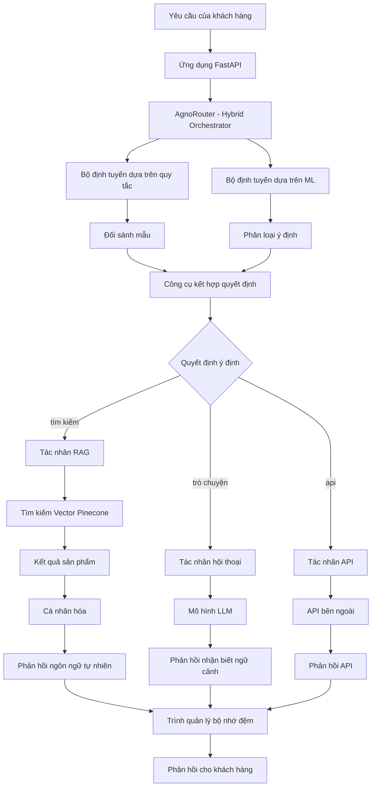

# Hệ thống AI Agent - Hybrid Orchestrator

Một hệ thống AI Agent thông minh cho thương mại điện tử với **Hybrid Orchestrator** kết hợp định tuyến dựa trên quy tắc và dựa trên ML. Hệ thống hỗ trợ hơn 900 điện thoại di động và nhiều danh mục sản phẩm khác như Máy tính xách tay, Máy tính bảng và Phụ kiện.

[](https://python.org)
[](https://fastapi.tiangolo.com)
[](https://docker.com)
[](https://pinecone.io)
[](LICENSE)

## Tính năng

- **Hybrid Orchestrator**: Kết hợp định tuyến dựa trên quy tắc và dựa trên ML để đạt độ chính xác cao (85-95%).
- **Bộ dữ liệu đa danh mục**: Hỗ trợ điện thoại di động, máy tính xách tay, máy tính bảng và phụ kiện (CSV + JSON).
- **Hệ thống RAG**: Thực hiện tìm kiếm ngữ nghĩa bằng Pinecone (có thể bật/tắt bằng `RAG_ENABLED=true`).
- **Trò chuyện thông minh**: Cung cấp tương tác tự nhiên, với cơ chế dự phòng khi RAG bị tắt.
- **Tích hợp API**: Kết nối với các microservice Spring Boot để xử lý đơn hàng, thanh toán và bảo hành (có thể bật/tắt bằng `ENABLE_API_CALLS`).
- **Cá nhân hóa**: Thích ứng với hành vi của người dùng và cung cấp các đề xuất (tùy chọn).
- **Hỗ trợ đa mô hình**: Tương thích với nhiều LLM khác nhau, bao gồm Gemini, Groq, Ollama và OpenAI.
- **Bộ nhớ đệm**: Có hệ thống bộ nhớ đệm thông minh với các tùy chọn Redis và trong bộ nhớ.
- **Giám sát**: Cung cấp giám sát hiệu suất thời gian thực thông qua một bảng điều khiển chi tiết.
- **Đào tạo**: Bao gồm một quy trình dữ liệu hoàn chỉnh để tinh chỉnh các mô hình cho lĩnh vực thương mại điện tử.
- **Sẵn sàng cho sản xuất**: Được xây dựng với FastAPI, PyTorch và các mẫu async/await hiện đại.

## Các khái niệm cốt lõi

### Hybrid Orchestrator
Hybrid Orchestrator là bộ não của hệ thống, quyết định cách xử lý các yêu cầu của người dùng. Nó sử dụng hai chiến lược chính:

- **Định tuyến dựa trên quy tắc**: Nhanh chóng và có thể dự đoán được, phương pháp này sử dụng các biểu thức chính quy để khớp các truy vấn của người dùng với các ý định cụ thể (ví dụ: "tìm" cho `search`, "#1234" cho `order`). Nó lý tưởng cho các yêu cầu đơn giản, rõ ràng.
- **Định tuyến dựa trên ML**: Linh hoạt và nhận biết ngữ cảnh hơn, phương pháp này sử dụng một mô hình phân loại ý định để hiểu mục tiêu của người dùng. Nó tốt hơn cho các truy vấn phức tạp hoặc không rõ ràng.
- **Kết hợp quyết định**: Hệ thống kết hợp đầu ra của cả hai bộ định tuyến, sử dụng cơ chế trọng số để đưa ra quyết định cuối cùng. Cách tiếp cận kết hợp này cung cấp cả tốc độ của các hệ thống dựa trên quy tắc và sự thông minh của các mô hình ML.

### RAG (Retrieval-Augmented Generation)
Khi người dùng đặt câu hỏi về một sản phẩm, hệ thống sử dụng RAG để cung cấp câu trả lời chính xác. Đây là cách nó hoạt động:
1. **Truy xuất**: Truy vấn của người dùng được chuyển đổi thành một vector embedding và được sử dụng để tìm kiếm một cơ sở dữ liệu vector Pinecone chứa tất cả thông tin sản phẩm.
2. **Bổ sung**: Thông tin sản phẩm phù hợp nhất được truy xuất và thêm vào truy vấn ban đầu của người dùng làm ngữ cảnh.
3. **Tạo**: Văn bản kết hợp (truy vấn ban đầu + ngữ cảnh được truy xuất) được gửi đến một mô hình ngôn ngữ lớn (LLM), mô hình này sẽ tạo ra một câu trả lời tự nhiên, giống như con người dựa trên thông tin được cung cấp.
Quá trình này đảm bảo rằng các câu trả lời được dựa trên dữ liệu sản phẩm thực tế, giảm nguy cơ mô hình "ảo giác" ra các chi tiết không chính xác.

### Cá nhân hóa
Hệ thống có thể điều chỉnh các câu trả lời và đề xuất của mình cho từng người dùng. Khi được bật, nó sẽ theo dõi các tương tác của người dùng (như tìm kiếm và mua hàng) để xây dựng hồ sơ người dùng. Hồ sơ này sau đó được sử dụng để:
- Sắp xếp lại kết quả tìm kiếm để hiển thị các sản phẩm mà người dùng có nhiều khả năng quan tâm hơn.
- Cung cấp các đề xuất sản phẩm được cá nhân hóa.

### Tích hợp dịch vụ
AI Agent được thiết kế để hoạt động như một phần của một hệ sinh thái microservice lớn hơn. Nó có thể giao tiếp với các dịch vụ backend khác (ví dụ: được viết bằng Spring Boot) để xử lý các tác vụ như:
- Lấy trạng thái đơn hàng.
- Xử lý thanh toán.
- Kiểm tra thông tin bảo hành.
Điều này được xử lý bởi `APIModel`, thực hiện các yêu cầu HTTP đến các dịch vụ khác.

## Kiến trúc hệ thống


```mermaid
graph TB
    A[Yêu cầu của khách hàng] --> B[Ứng dụng FastAPI]
    B --> C[AgnoRouter - Hybrid Orchestrator]
    
    C --> D[Bộ định tuyến dựa trên quy tắc]
    C --> E[Bộ định tuyến dựa trên ML]
    
    D --> F[Đối sánh mẫu]
    E --> G[Phân loại ý định]
    
    F --> H[Công cụ kết hợp quyết định]
    G --> H
    
    H --> I{Quyết định ý định}
    
    I -->|tìm kiếm| J[Tác nhân RAG]
    I -->|trò chuyện| K[Tác nhân hội thoại]
    I -->|api| L[Tác nhân API]
    
    J --> M[Tìm kiếm Vector Pinecone]
    M --> N[Kết quả sản phẩm]
    N --> O[Cá nhân hóa]
    O --> P[Phản hồi ngôn ngữ tự nhiên]
    
    K --> Q[Mô hình LLM]
    Q --> R[Phản hồi nhận biết ngữ cảnh]
    
    L --> S[API bên ngoài]
    S --> T[Phản hồi API]
    
    P --> U[Trình quản lý bộ nhớ đệm]
    R --> U
    T --> U
    
    U --> V[Phản hồi cho khách hàng]
```

## Bắt đầu

### Điều kiện tiên quyết
- Python 3.10+
- Docker (tùy chọn, để chạy với Docker)
- Một khóa API từ một nhà cung cấp LLM (ví dụ: Google AI Studio cho Gemini)

### Cài đặt
1. **Sao chép kho lưu trữ**:
    ```bash
    git clone <repository-url>
    cd ai-agent
    ```
2. **Tạo một môi trường ảo**:
    ```bash
    python -m venv venv
    source venv/bin/activate  # Trên Windows, sử dụng `venv\Scripts\activate`
    ```
3. **Cài đặt các phụ thuộc**:
    ```bash
    pip install -r requirements.txt
    ```

### Cấu hình (`.env`)
1. **Tạo một tệp `.env`** bằng cách sao chép tệp ví dụ:
    ```bash
    cp env.example .env
    ```
2. **Chỉnh sửa tệp `.env`** để thêm cấu hình của bạn. Tối thiểu, bạn cần cung cấp một khóa API cho LLM bạn muốn sử dụng.

    **Cấu hình cần thiết**:
    ```env
    # Backend để sử dụng cho mô hình ngôn ngữ. Các tùy chọn: "gemini", "groq", "openai", v.v.
    MODEL_LOADER_BACKEND=gemini
    
    # Mô hình cụ thể để sử dụng.
    MODEL_NAME=gemini-1.5-flash
    
    # Khóa API của bạn cho backend đã chọn.
    GEMINI_API_KEY=your_gemini_api_key
    ```
    **Bật RAG và các cuộc gọi API**:
    ```env
    # Đặt thành true để bật hệ thống RAG để tìm kiếm sản phẩm.
    # Yêu cầu phải đặt PINECONE_API_KEY và PINECONE_INDEX_NAME.
    RAG_ENABLED=true
    PINECONE_API_KEY=your_pinecone_api_key
    PINECONE_INDEX_NAME=your-pinecone-index
    
    # Đặt thành true để cho phép tác nhân gọi các microservice bên ngoài.
    # Yêu cầu phải đặt các URL dịch vụ (ví dụ: ORDER_SERVICE_URL).
    ENABLE_API_CALLS=true
    ORDER_SERVICE_URL=http://localhost:8181/api/orders
    ```

### Chạy ứng dụng

**Cục bộ**:
```bash
python app.py
```
Ứng dụng sẽ có sẵn tại `http://localhost:8000`.

**Với Docker**:
Đây là cách được khuyến nghị để chạy ứng dụng trong một môi trường giống như sản xuất.
```bash
docker-compose up -d
```
Lệnh này sẽ xây dựng hình ảnh Docker và khởi động các container `ai-agent` và `redis`.

## Các điểm cuối API

### `POST /ask`
Đây là điểm cuối chính để tương tác với AI agent.

**Nội dung yêu cầu**:
```json
{
  "message": "OnePlus dưới 50 triệu",
  "user_id": "user123",
  "session_id": "session001",
  "intent": "search"
}
```
- `message` (string, bắt buộc): Tin nhắn của người dùng.
- `user_id` (string, tùy chọn): Một mã định danh duy nhất cho người dùng, được sử dụng để cá nhân hóa.
- `session_id` (string, tùy chọn): Một mã định danh cho phiên trò chuyện hiện tại.
- `intent` (string, tùy chọn): Có thể được sử dụng để buộc một ý định cụ thể (`search`, `order`, `chat`, `api`).

**Nội dung phản hồi**:
```json
{
  "user_id": "user123",
  "response": "Tôi đã tìm thấy một số điện thoại OnePlus phù hợp với ngân sách của bạn...",
  "intent": "search",
  "confidence": 0.95,
  "session_id": "session001",
  "metadata": {
    "model_info": { "backend": "gemini", "model_name": "gemini-1.5-flash" },
    "search_results": [...]
  }
}
```

### Các điểm cuối giám sát
- **`GET /health`**: Kiểm tra tình trạng của ứng dụng.
- **`GET /metrics`**: Cung cấp các chỉ số hiệu suất cho Hybrid Orchestrator.
- **`GET /dashboard`**: Trả về một bảng điều khiển toàn diện về hiệu suất hệ thống.
- **`GET /traces`**: Hiển thị các dấu vết yêu cầu gần đây để gỡ lỗi.

### Các điểm cuối đào tạo
- **`POST /training/start`**: Bắt đầu quy trình đào tạo mô hình.
- **`GET /training/status`**: Lấy trạng thái hiện tại của quá trình đào tạo.

## Cấu trúc dự án
```
ai_agent/
├── app.py # Điểm vào ứng dụng FastAPI
├── config.py # Cấu hình ứng dụng
├── requirements.txt # Các phụ thuộc Python
├── env.example # Mẫu biến môi trường
├── init_data.py # Tập lệnh để tải dữ liệu vào Pinecone
├── docker-compose.yml # Cấu hình Docker Compose
│
├── core/ # Lõi logic ứng dụng
│ ├── router.py # Hybrid Orchestrator
│ ├── rag_model.py # Triển khai RAG
│ ├── interaction_model.py # Xử lý cuộc trò chuyện chung
│ └── api_model.py # Xử lý giao tiếp với các API bên ngoài
│
├── adapters/ # Bộ điều hợp cho các dịch vụ bên ngoài
│ ├── model_loader/ # Bộ tải cho các LLM khác nhau
│ └── pinecone_client.py # Máy khách Pinecone
│
├── data/ # Tệp dữ liệu và lược đồ
│ ├── Mobiles Dataset (2025).csv # Dữ liệu sản phẩm mẫu
│ └── schema/ # Lược đồ dữ liệu
│
├── personalization/ # Lõi logic cá nhân hóa
│ ├── profile_manager.py # Quản lý hồ sơ người dùng
│ └── recommender.py # Tạo đề xuất
│
├── services/ # Máy khách cho các microservice bên ngoài
│
├── training/ # Đào tạo và tinh chỉnh mô hình
│
└── utils/ # Các hàm tiện ích
```

## Cách đóng góp
Chúng tôi hoan nghênh các đóng góp cho dự án! Đây là cách bạn có thể giúp đỡ:
1. **Fork kho lưu trữ**.
2. **Tạo một nhánh tính năng mới**: `git checkout -b feature/your-feature-name`
3. **Thực hiện các thay đổi của bạn** và cam kết chúng: `git commit -m 'Thêm một số tính năng tuyệt vời'`
4. **Đẩy vào nhánh**: `git push origin feature/your-feature-name`
5. **Mở một yêu cầu kéo**.

Vui lòng đảm bảo viết các bài kiểm tra cho bất kỳ chức năng mới nào và tuân theo kiểu mã hiện có.

## Giấy phép
Dự án này được cấp phép theo Giấy phép MIT. Xem tệp `LICENSE` để biết thêm chi tiết.
