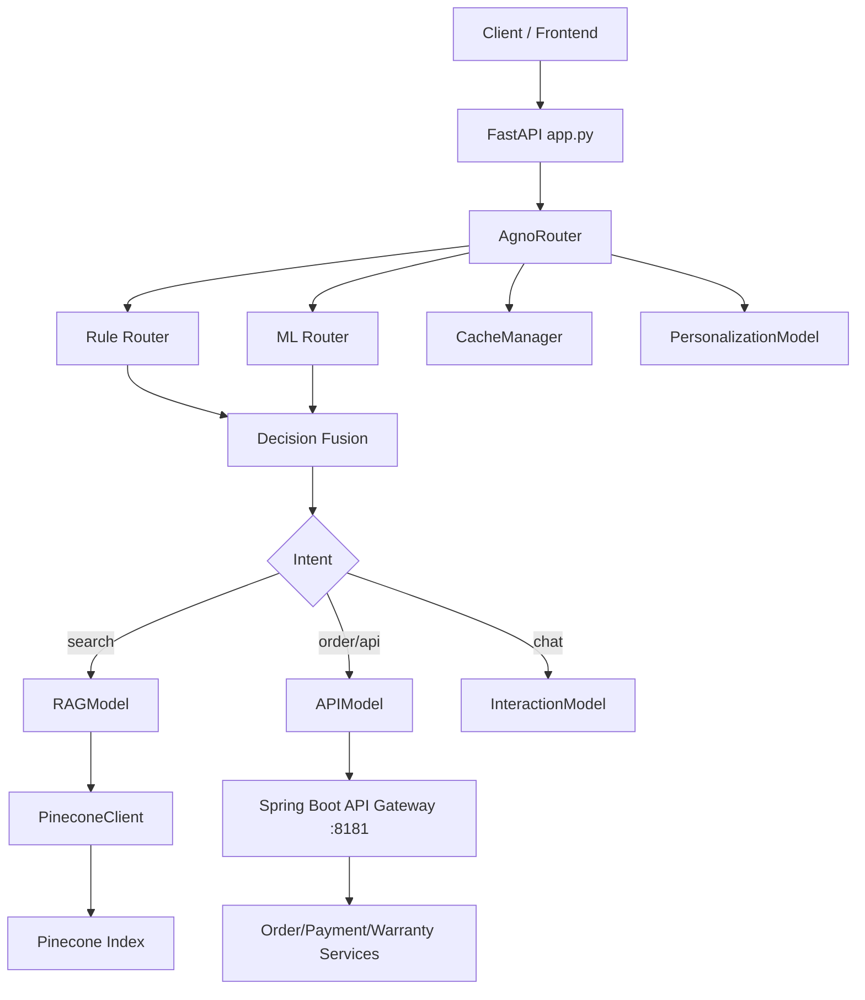
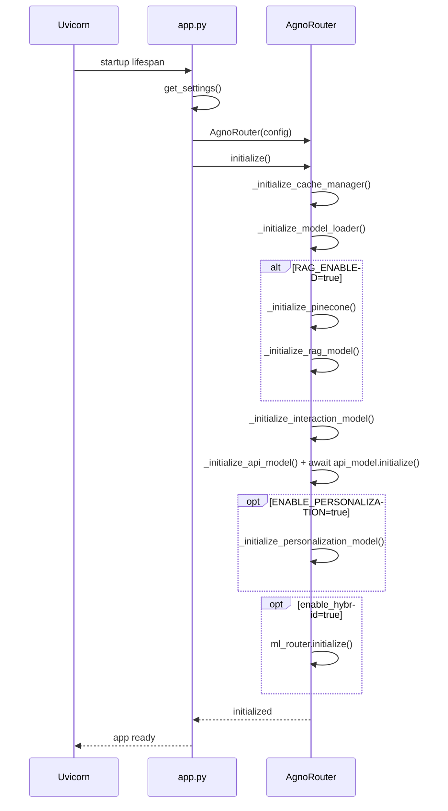
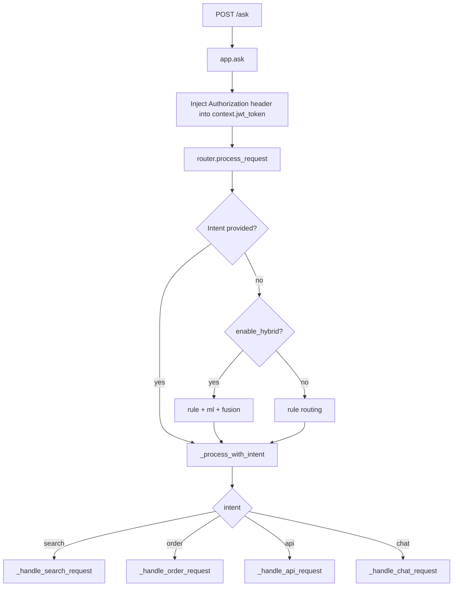
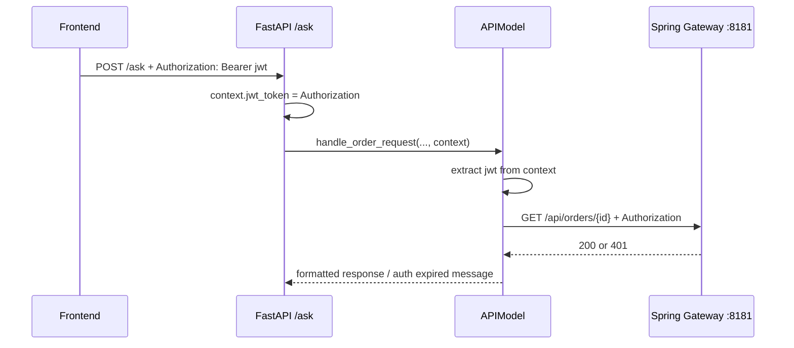

# AI Agent System - Hybrid Orchestrator

Hệ thống AI Agent cho e-commerce, kết hợp **rule-based routing** và **ML-based routing** để xử lý hội thoại, tìm kiếm sản phẩm (RAG), và gọi API microservices (orders/payments/warranty).

- Python 3.10+
- FastAPI 0.115+
- Pinecone (tùy chọn khi bật RAG)
- Spring Boot Gateway/Microservices (tùy chọn khi bật API calls)

---

## Mục lục

- [1. Tổng quan](#1-tổng-quan)
- [2. Kiến trúc hệ thống](#2-kiến-trúc-hệ-thống)
- [3. Luồng xử lý chi tiết](#3-luồng-xử-lý-chi-tiết)
- [4. Cài đặt và chạy nhanh](#4-cài-đặt-và-chạy-nhanh)
- [5. Cấu hình `.env`](#5-cấu-hình-env)
- [6. API Endpoints](#6-api-endpoints)
- [7. Tích hợp Frontend (quan trọng)](#7-tích-hợp-frontend-quan-trọng)
- [8. Dữ liệu và ingest](#8-dữ-liệu-và-ingest)
- [9. Monitoring & Training](#9-monitoring--training)
- [10. Troubleshooting](#10-troubleshooting)
- [11. Cấu trúc thư mục](#11-cấu-trúc-thư-mục)

---

## 1. Tổng quan

### 1.1 Mục tiêu

AI Agent xử lý một request `/ask` theo các nhóm nghiệp vụ:

1. **Search**: tìm sản phẩm bằng RAG + Pinecone + personalizer.
2. **Order/API**: tra cứu đơn hàng, thanh toán, bảo hành qua Spring Boot services.
3. **Chat**: hội thoại thường bằng LLM.

### 1.2 Điểm nổi bật

- **Hybrid Orchestrator**: phối hợp kết quả từ Rule router + ML router.
- **RAG có fallback**: nếu tắt RAG vẫn trả lời chat/search cơ bản qua LLM.
- **API Auth forwarding**: tự forward JWT từ header frontend qua backend service.
- **Cache layer**: memory + redis (fallback memory khi redis lỗi).
- **Quan sát hệ thống**: health, metrics, dashboard, traces.

### 1.3 Tính năng mới đã triển khai

- **So sánh 2 sản phẩm**: nhận diện query kiểu `so sánh`, `compare`, `vs`, tự tìm 2 sản phẩm gần nhất và trả lời dạng so sánh.
- **Kiểm tra tồn kho**: nhận diện query kiểu `tồn kho`, `còn hàng`, `hết hàng`, `stock`, trả trạng thái còn/hết và số lượng ước tính.
- **Hỏi làm rõ thông số**: nếu query kỹ thuật còn mơ hồ (RAM/ROM/pin/camera/màn hình), bot hỏi lại để lọc chính xác hơn.
- **Ghi nhớ ngữ cảnh hội thoại**: lưu memory theo `user_id + session_id` qua CacheManager (ưu tiên Redis), dùng cho hội thoại nhiều lượt.

---

## 2. Kiến trúc hệ thống



### 2.1 Thành phần chính

- **`app.py`**
  - Khởi tạo FastAPI lifespan.
  - Build `RouterConfig` từ `config.py`.
  - Inject token header `Authorization` vào `context` khi gọi `router.process_request`.

- **`core/router.py` (AgnoRouter)**
  - Khởi tạo model loader, rag, api, personalization, ml router.
  - Route request theo intent (hybrid hoặc rule-only).
  - Dispatch đến `_handle_search_request`, `_handle_order_request`, `_handle_api_request`, `_handle_chat_request`.

- **`core/rag_model.py`**
  - Embed query qua Pinecone inference.
  - Search vectors + filter metadata + rerank.
  - Trả `product_url` và `specs_url` trong mỗi search result.

- **`core/api_model.py`**
  - Gọi Spring Boot services.
  - Forward JWT từ context (`jwt_token/access_token/token/authorization`) hoặc fallback token cấu hình.
  - Format response order/payment/warranty thân thiện.

- **`core/interaction_model.py`**
  - Tạo prompt hội thoại/search và gọi LLM.

---

## 3. Luồng xử lý chi tiết

## 3.1 Startup flow



## 3.2 Luồng `/ask`



## 3.3 Search flow (RAG)

1. Chuẩn hóa query + check cache.
2. `rag_model.search_products`:
   - extract metadata từ query (price/brand/specs),
   - embed query,
   - search Pinecone,
   - process kết quả (relevance, specs parse, URLs).
3. (Tuỳ chọn) personalization re-rank.
4. `interaction_model.generate_search_response`.
5. Trả metadata gồm `search_results`, `product_links`, `specs_links`.

## 3.4 Order/API flow

1. Router check auth (`user_id` hoặc context có auth info).
2. APIModel extract order id từ message.
3. APIModel gọi `GET /api/orders/{id}` với header `Authorization: Bearer <token>`.
4. Transform response Spring Boot về schema nội bộ.
5. Format text đẹp, dễ đọc, trả về client.

## 3.5 Auth token forwarding flow (quan trọng)



---

## 4. Cài đặt và chạy nhanh

```bash
git clone <repository-url>
cd AI_Agent
python -m venv venv
venv\Scripts\activate
pip install -r requirements.txt
copy env.example .env
python app.py
```

Kiểm tra:

```bash
curl http://localhost:8000/health
```

---

## 5. Cấu hình `.env`

Ví dụ tối thiểu:

```env
MODEL_LOADER_BACKEND=gemini
MODEL_NAME=gemini-2.5-flash
GEMINI_API_KEY=your_key

RAG_ENABLED=false
ENABLE_API_CALLS=true

ORDER_SERVICE_URL=http://localhost:8181/api/orders
PAYMENT_SERVICE_URL=http://localhost:8181/api/payments
WARRANTY_SERVICE_URL=http://localhost:8181/api/warranties
PRODUCT_SERVICE_URL=http://localhost:8181/api/products

# Optional fallback token nếu frontend không gửi Authorization
JWT_TOKEN=
```

Gợi ý:

- Bật RAG khi đã có `PINECONE_API_KEY` và chạy ingest.
- Nếu dùng frontend login, ưu tiên truyền token qua header thay vì `JWT_TOKEN` tĩnh.

---

## 6. API Endpoints

## 6.1 `POST /ask`

Request:

```json
{
  "message": "where is my order 8",
  "user_id": "20",
  "session_id": "20",
  "context": {}
}
```

Response chuẩn:

```json
{
  "user_id": "20",
  "response": "...",
  "intent": "order",
  "confidence": 0.8,
  "metadata": {}
}
```

## 6.2 Monitoring

- `GET /health`
- `GET /metrics`
- `GET /dashboard`
- `GET /traces`

## 6.3 Training (optional)

- `POST /training/start`
- `GET /training/status`
- `GET /training/history`
- `POST /training/prepare-data`
- `POST /training/evaluate`

## 6.4 Metadata kiểm tra ngữ cảnh

Khi gọi `POST /ask`, có thể kiểm tra các metadata sau để xác nhận memory hoạt động:

- `session_memory_used`: request hiện tại có dùng memory đã lưu từ lượt trước hay không.
- `history_turns`: số lượt hội thoại đã được nạp vào context.
- `resolved_search_query`: query đã được ghép từ ngữ cảnh trước (ví dụ câu follow-up: `RAM 8GB`).

---

## 6.5 Kịch bản test nhanh tính năng mới

### A) So sánh 2 sản phẩm

```json
{
  "message": "So sánh iPhone 15 và Samsung S24",
  "user_id": "u_test",
  "session_id": "s_compare_01"
}
```

### B) Kiểm tra tồn kho

```json
{
  "message": "iPhone 15 còn hàng không, kiểm tra tồn kho giúp mình",
  "user_id": "u_test",
  "session_id": "s_stock_01"
}
```

### C) Hỏi rõ thông số + follow-up theo ngữ cảnh

Lượt 1:

```json
{
  "message": "Tìm điện thoại chơi game cấu hình tốt",
  "user_id": "u_test",
  "session_id": "s_memory_01"
}
```

Lượt 2 (giữ nguyên `session_id`):

```json
{
  "message": "RAM 8GB, ROM 256GB",
  "user_id": "u_test",
  "session_id": "s_memory_01"
}
```

Kỳ vọng: response lượt 2 có `metadata.resolved_search_query`, và `history_turns > 0`.

### D) Bộ câu hỏi test đầy đủ

Xem danh sách đầy đủ tại `docs/TEST_QUESTIONS.md`.

---

## 7. Tích hợp Frontend (quan trọng)

## 7.1 Gửi token đúng cách

Dù user đã login ở web, backend AI **không tự biết token** nếu frontend không gửi token trong request `/ask`.

Bắt buộc gửi:

- Header: `Authorization: Bearer <access_token>`
- Và payload `user_id` / `session_id` nếu cần tracking.

Ví dụ `fetch`:

```javascript
const token = localStorage.getItem("access_token");

const res = await fetch("http://localhost:8000/ask", {
  method: "POST",
  headers: {
    "Content-Type": "application/json",
    "Authorization": `Bearer ${token}`,
  },
  body: JSON.stringify({
    message: "where is my order 8",
    user_id: "20",
    session_id: "20",
    context: {}
  })
});
```

## 7.2 Nếu gặp 401 khi tra cứu order

- Kiểm tra token có thực sự đi vào header `/ask`.
- Kiểm tra token còn hạn không.
- Kiểm tra API Gateway nhận đúng scheme `Bearer`.

---

## 8. Dữ liệu và ingest

## 8.1 Nguồn dữ liệu

- `Mobiles Dataset (2025).csv`
- JSON products trong `data/processed/`

## 8.2 Ingest lên Pinecone

```bash
python init_data.py
# hoặc
python init_data.py data/processed/sample_products_extra.json
```

Kết quả ingest:

- Tạo vector metadata gồm name/brand/price/specs.
- Search trả về thêm `product_url`, `specs_url` để frontend điều hướng.

---

## 9. Monitoring & Training

- Monitoring endpoints cho health/perf/traces.
- Có pipeline thu conversation để huấn luyện tiếp.
- Training module là optional; system vẫn chạy bình thường nếu không bật.

---

## 10. Troubleshooting

## 10.1 `HTTP client not initialized`

Nguyên nhân: APIModel chưa init.

Đã xử lý trong code:

- Startup gọi `await self.api_model.initialize()` trong router.
- Có lazy auto-init fallback trong `_call_spring_boot_service`.

## 10.2 `401 Unauthorized` khi order

Nguyên nhân: thiếu hoặc hết hạn JWT khi AI backend gọi qua Gateway.

Cách xử lý:

1. Frontend gửi `Authorization` header khi gọi `/ask`.
2. Backend AI forward token vào call downstream.
3. Nếu cần fallback local, set `JWT_TOKEN` trong `.env`.

## 10.3 Không ra kết quả search

- Check `RAG_ENABLED=true`.
- Check đã ingest dữ liệu (`init_data.py`).
- Check `PINECONE_API_KEY`, index name/dimension.

## 10.4 Response chậm

- Bật cache Redis/memory.
- Giảm `max_products_in_prompt`.
- Dùng model backend nhanh hơn.

---

## 11. Cấu trúc thư mục

```text
AI_Agent/
├── app.py
├── config.py
├── init_data.py
├── requirements.txt
├── README.md
├── core/
│   ├── router.py
│   ├── rag_model.py
│   ├── interaction_model.py
│   ├── api_model.py
│   └── models/
├── adapters/
│   ├── pinecone_client.py
│   └── model_loader/
├── cache/
├── monitoring/
├── personalization/
├── services/
├── data/
└── training/
```

---

## License

MIT License.

## Contact

- support@ai-agent.com
- GitHub Issues / Discussions
