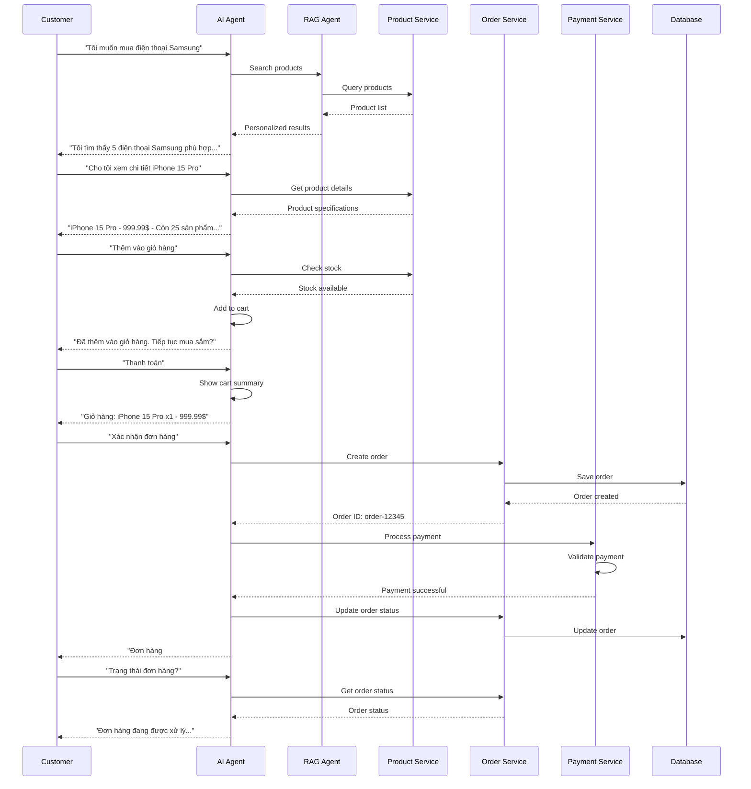
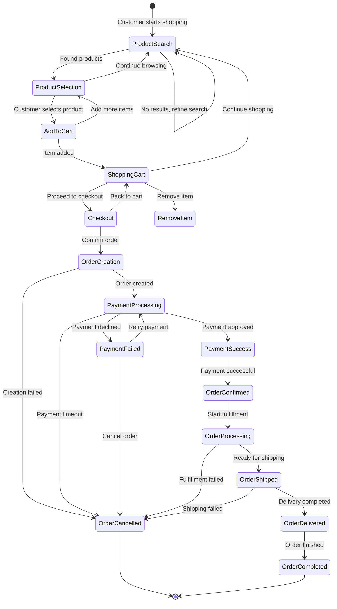
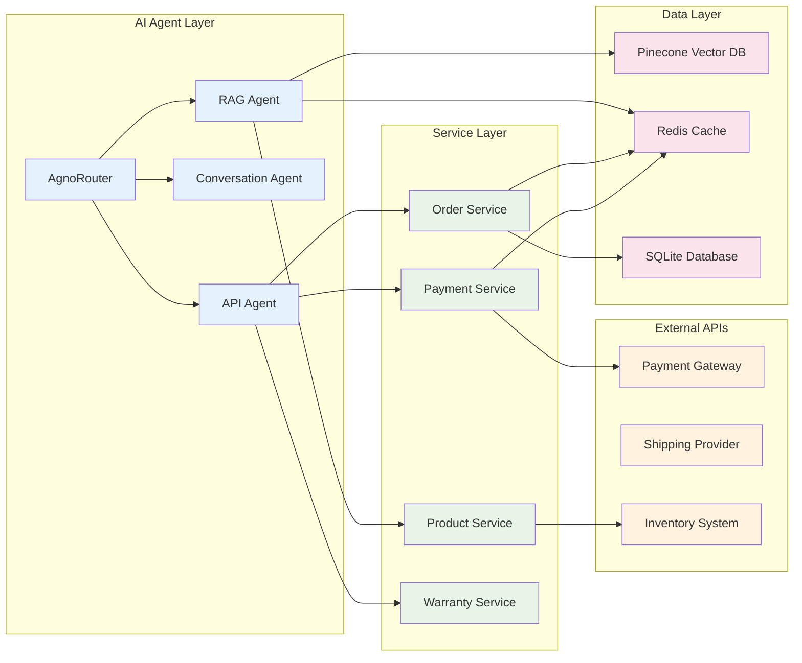
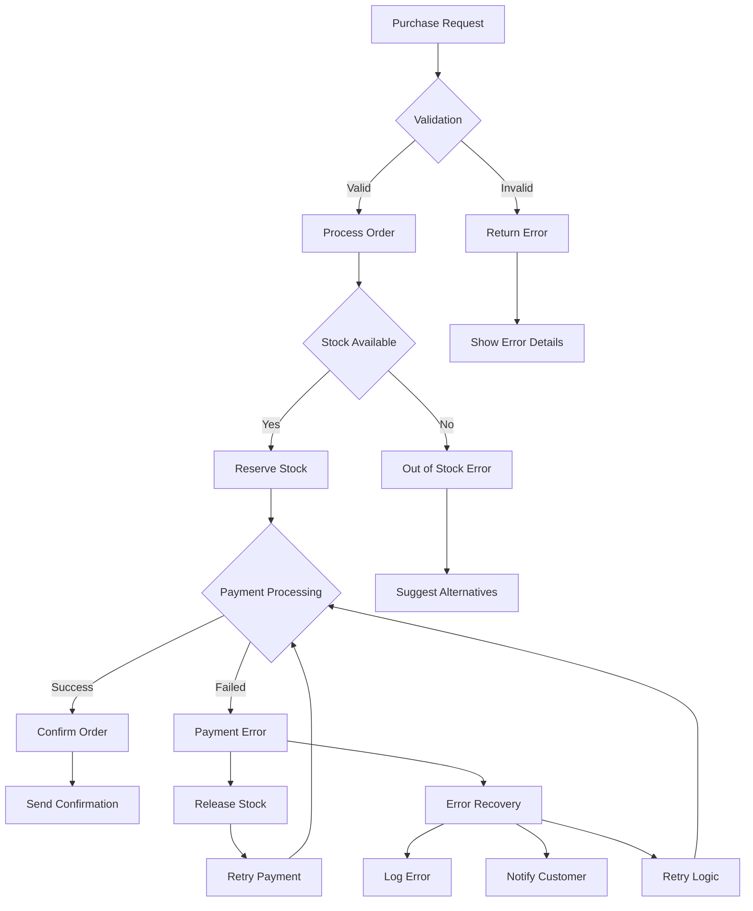
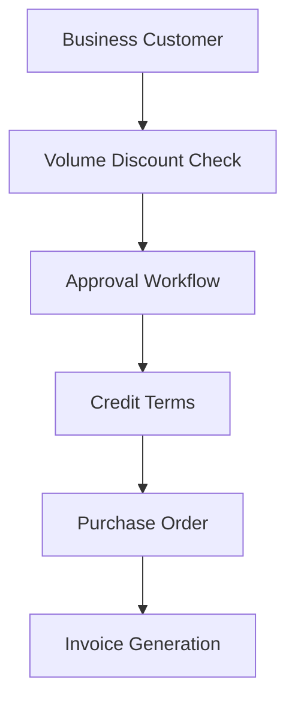
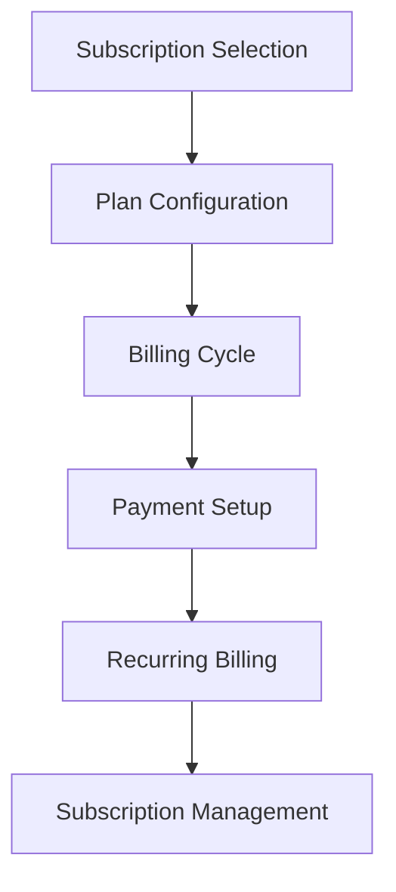
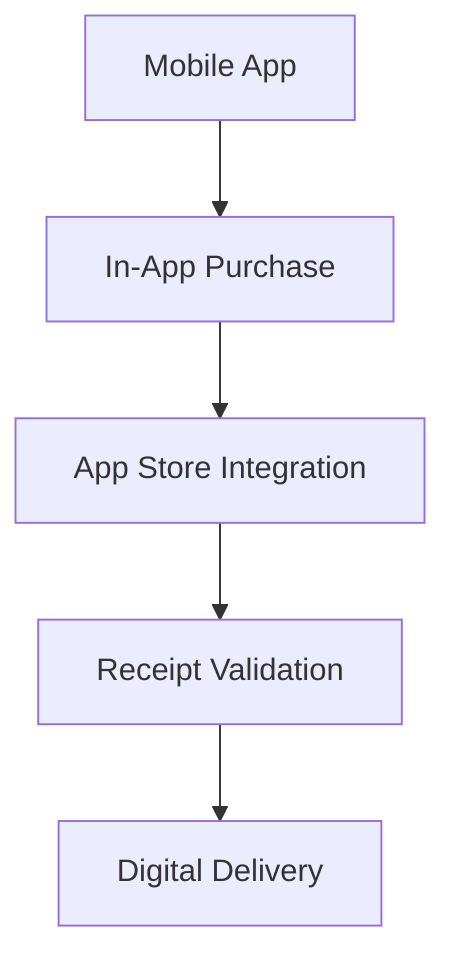

# Workflow Mua Hàng - AI Agent E-commerce System

## Tổng quan Workflow Mua Hàng

Workflow này mô tả quy trình mua hàng hoàn chỉnh trong hệ thống AI Agent, từ tìm kiếm sản phẩm đến hoàn thành đơn hàng.

## Main Purchase Workflow

```mermaid
graph TB
    %% Customer Entry Point
    A[Khách hàng truy cập] --> B[AI Agent Chat Interface]
    B --> C[Intent Detection: Mua hàng]
    
    %% Product Discovery
    C --> D[Product Search & Discovery]
    D --> D1[RAG Agent - Tìm kiếm sản phẩm]
    D1 --> D2[Pinecone Vector Search]
    D2 --> D3[Product Recommendations]
    D3 --> D4[Personalized Results]
    
    %% Product Selection
    D4 --> E[Product Selection Process]
    E --> E1[Product Details View]
    E1 --> E2[Price & Specification Check]
    E2 --> E3[Stock Availability Check]
    E3 --> E4[Customer Decision]
    
    %% Shopping Cart
    E4 --> F{Shopping Cart}
    F -->|Add to Cart| G[Add to Cart]
    F -->|Continue Shopping| D
    F -->|Checkout| H[Checkout Process]
    
    %% Checkout Flow
    H --> H1[Cart Review]
    H1 --> H2[Shipping Address]
    H2 --> H3[Payment Method Selection]
    H3 --> H4[Order Summary]
    H4 --> H5[Order Confirmation]
    
    %% Order Processing
    H5 --> I[Order Creation]
    I --> I1[Order Service API]
    I1 --> I2[Order Validation]
    I2 --> I3[Inventory Check]
    I3 --> I4[Order ID Generation]
    
    %% Payment Processing
    I4 --> J[Payment Processing]
    J --> J1[Payment Service API]
    J1 --> J2[Payment Gateway]
    J2 --> J3[Payment Validation]
    J3 --> J4{Payment Status}
    
    %% Payment Results
    J4 -->|Success| K[Payment Success]
    J4 -->|Failed| L[Payment Failed]
    L --> L1[Retry Payment]
    L1 --> J
    L --> L2[Cancel Order]
    
    %% Order Fulfillment
    K --> M[Order Fulfillment]
    M --> M1[Update Order Status: Confirmed]
    M1 --> M2[Inventory Deduction]
    M2 --> M3[Order Processing]
    M3 --> M4[Shipping Preparation]
    M4 --> M5[Order Shipped]
    
    %% Order Tracking
    M5 --> N[Order Tracking]
    N --> N1[Status Updates]
    N1 --> N2[Delivery Confirmation]
    N2 --> N3[Order Completed]
    
    %% Customer Support
    N3 --> O[Post-Purchase Support]
    O --> O1[Order History]
    O --> O2[Return/Exchange]
    O --> O3[Warranty Service]
    
    %% Styling
    classDef customer fill:#e3f2fd
    classDef aiAgent fill:#f3e5f5
    classDef product fill:#e8f5e8
    classDef order fill:#fff3e0
    classDef payment fill:#fce4ec
    classDef fulfillment fill:#f1f8e9
    classDef support fill:#e0f2f1
    
    class A,B customer
    class C,D1,D2,D3,D4 aiAgent
    class D,E,E1,E2,E3,E4,F,G product
    class H,H1,H2,H3,H4,H5,I,I1,I2,I3,I4 order
    class J,J1,J2,J3,J4,K,L,L1,L2 payment
    class M,M1,M2,M3,M4,M5,N,N1,N2,N3 fulfillment
    class O,O1,O2,O3 support
```



## Detailed Purchase Flow



## E-commerce Purchase States



## API Integration Flow



## Purchase Workflow Configuration

### 1. Product Search Configuration
```yaml
product_search:
  enabled: true
  max_results: 10
  personalization: true
  filters:
    - price_range
    - brand
    - category
    - rating
  sorting:
    - relevance
    - price_low_high
    - price_high_low
    - rating
    - newest
```

### 2. Shopping Cart Configuration
```yaml
shopping_cart:
  enabled: true
  max_items: 50
  session_timeout: 3600  # 1 hour
  persistence: true
  features:
    - save_for_later
    - wishlist
    - quantity_update
    - bulk_operations
```

### 3. Checkout Configuration
```yaml
checkout:
  steps:
    - cart_review
    - shipping_address
    - payment_method
    - order_review
    - confirmation
  
  validation:
    - stock_check
    - price_verification
    - address_validation
    - payment_validation
  
  security:
    - csrf_protection
    - rate_limiting
    - fraud_detection
```

### 4. Payment Configuration
```yaml
payment:
  methods:
    - credit_card
    - debit_card
    - paypal
    - bank_transfer
  
  processing:
    timeout: 30  # seconds
    retry_attempts: 3
    webhook_validation: true
  
  security:
    - pci_compliance
    - encryption
    - tokenization
```

## Error Handling & Recovery



## Performance Metrics

### Key Performance Indicators (KPIs)
- **Conversion Rate**: % visitors who complete purchase
- **Cart Abandonment Rate**: % who add to cart but don't buy
- **Average Order Value**: Total revenue / Number of orders
- **Payment Success Rate**: % successful payments
- **Order Processing Time**: Time from order to confirmation
- **Customer Satisfaction**: Rating and feedback scores

### Monitoring Dashboard
```yaml
metrics:
  conversion:
    - add_to_cart_rate
    - checkout_completion_rate
    - payment_success_rate
  
  performance:
    - search_response_time
    - checkout_processing_time
    - payment_processing_time
  
  business:
    - daily_revenue
    - top_products
    - customer_retention
    - cart_abandonment_reasons
```

## Customization Examples

### 1. B2B Purchase Flow


### 2. Subscription Purchase


### 3. Mobile App Purchase


## Testing Scenarios

### 1. Happy Path Testing
```python
def test_complete_purchase_flow():
    # 1. Search for product
    # 2. Add to cart
    # 3. Proceed to checkout
    # 4. Complete payment
    # 5. Verify order confirmation
    pass
```

### 2. Error Scenarios
```python
def test_payment_failure():
    # 1. Add product to cart
    # 2. Proceed to checkout
    # 3. Simulate payment failure
    # 4. Verify error handling
    # 5. Test retry mechanism
    pass
```

### 3. Edge Cases
```python
def test_out_of_stock():
    # 1. Add product to cart
    # 2. Simulate stock depletion
    # 3. Proceed to checkout
    # 4. Verify stock validation
    # 5. Test alternative suggestions
    pass
```

---

**Lưu ý**: Workflow này có thể được customize theo nhu cầu cụ thể của từng loại hình kinh doanh và tích hợp với các hệ thống bên ngoài khác nhau.
